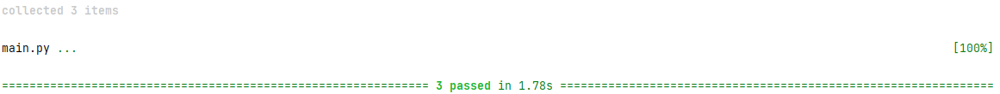

# pytest-QA

Данный тестовый набор для фреймворка Pytest, демонстрирует способ автотестирования API по позитивнму и негативному сценариям,  через GET запрос к серверу https://api.coingecko.com

Тестовый запрос: https://api.coingecko.com/api/v3/simple/price?ids={id}&vs_currencies=usd

Файл сценария: [coingecko autotest](main.py)

Наборы тестовых данных {id}:

VAL: "bitcoin", "ethereum", "ripple"

NOT VAL: "", "1234567890", " @test"

ER для test_positive_coingecko(id): {id:{"usd":(int,float)}}

ER для test_negative_coingecko(id): {}

Версия Python: 3.11.2

Версия pytest: 7.3.0

Тестовый сценарий:

``` Python
import pytest
import requests
import json

# Декорируем функцию test_positive_coingecko параметризованными тестами с параметром "id",
# который последовательно принимет значения из списка валидных тестовых данных
@pytest.mark.parametrize("id", ["bitcoin", "ethereum", "ripple"])
def test_positive_coingecko(id):
    # Отправляем GET запрос с заданными параметрами id и vs_currencies
    response = requests.get(f"https://api.coingecko.com/api/v3/simple/price?ids={id}&vs_currencies=rub")
    # Проверяем, что HTTP статус кода ответа равен 200
    assert response.status_code == 200
    # Загружаем JSON-ответ в объект Python
    json_response = json.loads(response.text)
    # Проверяем наличие ключа, соответствующего id в JSON ответе
    assert id in json_response.keys()
    # Проверяем, наличие ключа "usd" и тип его значения
    assert isinstance(json_response[id].get("rub"), (int, float))

# Декорируем функцию test_negative_coingecko параметризованными тестами с параметром "id",
# который последовательно принимает значения из списка невалидных тестовых данных
@pytest.mark.parametrize("id", ["", "1234567890", " @test"])
def test_negative_coingecko(id):
    # Отправляем GET запрос с заданными параметрами id и vs_currencies
    response = requests.get(f"https://api.coingecko.com/api/v3/simple/price?ids={id}&vs_currencies=usd")
    # Проверяем, что HTTP статус кода ответа равен 200
    assert response.status_code == 200
    # Загружаем JSON ответ в объект Python
    json_response = json.loads(response.text)
    # Проверяем, что JSON ответ пуст
    assert json_response == {}
```

Результат успешного прохождения набора тестов :



Успехов в Вашей работе!


